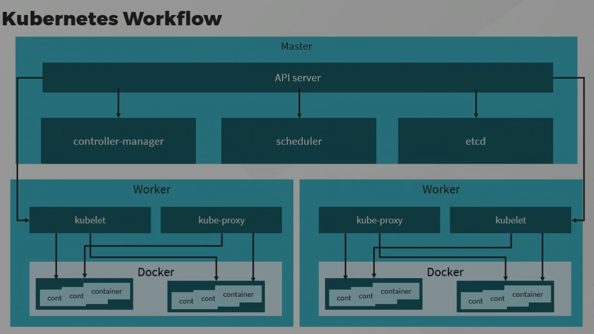

# 📅 Date: 2025-08-09

## 🎯 Goals for Today

- Finish "Working with containers: Introduction to Docker"
- Finish "Introduction to Kubernetes"

## ✅ What I Did

- Completed and finished the test.
- got a high level understanding. only theory and not practical

## 💡 Key Takeaways

- Course overview - Different services provided by docker
- Docker Overview - Is an open platform, Isolates application from OS, accelerates devlopment time. Fast to deploy and fast to run. Package and run your applicaiton in a server. You can use docker to run mulitple containers. Lightweight and shareable. Docker facilitates multiple releases a week. For executing multiple workloads. For deployment and scaling. Efficiency, speed and portability.
- Docker workflow - First, Write and test your application. Second, Build a container image. 3. Push images to a server. 4. Start your application finally maintain the application. you can develop in IDE or directly run the container and edit it there. Build an artifact, write a dockerfile, you can also use tools. once image is build push. Podman or system D to start the application.
- How to provision docker resources - Multiple options to run the 'docker run' command.
  syntax - docker run [OPTIONS] IMAGE[:TAG|@DIGEST][COMMAND] {ARG...}
  only person running the command can set the options command -d for detach --name to specify name. the command in the sytax is optional .. only docker run is basic
  docker stop command -t , docker kill (both with stop .. stop is graceful and kill is complete shutdown)
  docker ps using -a and -f to list the containers
  docker rm is for removing one or more docker containers simultaneously
- Elements of Docker Image - Diff b/w docker container and docker image. Docker container is a virtualised environment created on top of image. image gets created when containerised applicaiton is started. Base image , parent image. Base image is from scratch, from ubuntu or from something is parent image.
- Docker files - Text document, contains commands to assemble image. build context is used because image will not be running in the same machine. it supports git repository urls. Build is ran by docker demon itself. workdir - from where the argument following command will run.
- Docker build commands - Builds docker image. docker tag can be V1/V2 etc .. docker login is used to login to a docker registry.
- How to manage docker resources - docker run is used to run a container. combining create and start command. docker stop is used to stop. docker ps command to show all the containers. -a is for all -f is to filter. docker ls to list .. both ls and ps are interchangable .. ls is newer. docker rmi is to remove the image (not containers), to remove from host node
- docker use cases - microservice - spin up container each of the specific container. Freedom to run all your applications in the environment we specify. applicaiton isolation, developer productivity. Cloud application - use much easier in cloud environment and cost control.
- course summary - overview of docker and its usefulness, workflow.

---

- Introduction - for any infra scaling and automation is important.
- Kubernetes foundation - Open source. docker can be given to kubernetes to run the application. Run across cluster of machines. Manages life cycle. k8s can scale services up or down. We will be working with k8s cluster, nodes run containerized apps. containers can run across multiple enviornments. cluster contains one master node. serveral worker node. all worker together as one system. API server - is used by kubectl, scheduler, controller manager, kubelet, kube-proxy, etcd - key value store in master node. Determine the desired state like all time there should be 3 containers (e.g). user manifests to define, use k8s api and manage automatically.
- Kubernetes terms - K8S API - declerative tool. Cluster - group of bunch of nodes , k8s control plane - makes sure everything behave properly (maintains records), node , pod - smallest deployable unit, group of one or more containers. Master maintains desired state of a cluster. changes made to master and that takes to worker node, volume - container should write the data all the time to volume so something goes down data can be restored from volume. persistent volume, kubectl, minikube, kubelets, manifests,control plane.
- Kubernetes workflow - Master node has API server, controller-manager, scheduler, etcd. Worker node has kubelet, kube-proxy, has multiple pods and then each pods has multiple containers. job status monitoring, kube-controller-manager, abstraction layer
  
- Desired state in Kubernetes - Declerative or imperative API, describe object state. Kube-controller-manager, kubelet, API objects, etcd cluster. All the containers are in the same desired state
- Kubernetes resource provisioning - cluster life cycle - Design, deployment, operaion, deletion. finally deleting master node. Kubernetes is multi cluster orchestration. Tools to use to spin up and manage - Terraform, EKS, kOps. Rancher - to manage k8s. Loft - self service to manage k8s. (to spin up a simple k8s cluster)
- Application deployment in k8s - From local applicaiton to docker (dockerizing the applicaiton), create a deployment, expose the appication, provide a service and ingress to the service. config maps. Secure data using secrets, package the k8s applicaiton using helm.
- Kubernetes cluster security - control k8s api access for different operations in k8s. control kubelet operation via security. no outside user should be able to access kubelet. Authorization is highlevel in kubernetes. secure your etcd which will record all the information. Keep the nodes isolated, only communicate to master node and that should take care of comms to worker node. use github or google to authenticate. make sure kubelet is lockdown and secure. audit logging - make sure it is enabled. Aqua is a tool to enhance kubernetes security.
- Kubernetes use cases - k8s provides a way to schedule and deploy. scale containers, create portable workloads, build extensible apps, Lift and shift. IoT - Internet of Things deployment, self healing services, serverless architecture, You can use machine learning, CICD software development, HPF - High performance computing
- Kubernetes vs Docker - Docker has its own developer tools, container runtime, docker swarm, image sharing. Kubernetes has open source orchestration software, API for container management. featueres of k8s - Automation, flexibility, scalability,

## 🧠 Questions

-

## 📌 Next Steps

-
-
